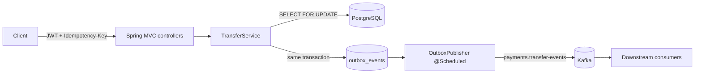

# Payment Transaction Service

A Spring Boot microservice for opening accounts and moving money between them. It shows how to handle the problems that come up in real payment APIs: duplicate requests, concurrent updates to the same balance, events that must not be lost, and secured access.

> **Portfolio project.** I wrote this independently with synthetic data to show design and coding practices I use. It does not contain code, data, or architecture from any employer or client.


## What it covers

| Problem | How it is handled |
|---|---|
| Client retries create duplicate payments | `Idempotency-Key` header. Same key + same body returns the original transfer (`200`, `Idempotent-Replayed: true`). Same key + different body returns `409`. A unique constraint handles two requests racing with one key. |
| Two transfers update the same balance at once | Both account rows are locked with `SELECT ... FOR UPDATE` in a fixed (UUID) order, which prevents deadlocks between opposite transfers. `@Version` adds an optimistic check. |
| Event published for a transfer that rolled back, or never published | Transactional outbox: the `TransferCompleted` event is written in the same DB transaction as the balances, then a scheduled publisher sends it to Kafka (at-least-once, keyed by transfer id). |
| Unclear API errors | RFC 9457 problem details with stable codes (`INSUFFICIENT_FUNDS`, `CURRENCY_MISMATCH`, `ACCOUNT_NOT_ACTIVE`, `IDEMPOTENCY_KEY_REUSED`, `VALIDATION_FAILED`). |
| Access control | OAuth 2.0 resource server validating JWTs. `payments.read` scope for GET, `payments.write` for changes. |
| Tracing a request through logs | `X-Correlation-Id` is accepted or generated, returned in the response, and added to every log line. |

## Architecture



## Tech stack

Java 21 · Spring Boot 3.5 · Spring Web MVC · Spring Data JPA / Hibernate · Spring Security (OAuth 2.0 resource server, JWT) · Spring Kafka · PostgreSQL 16 · Flyway · springdoc-openapi · Micrometer/Prometheus · JUnit 5 · MockMvc · Testcontainers · H2 · JaCoCo · Docker · Kubernetes manifests · GitHub Actions

## API

| Method | Path | Scope | Description |
|---|---|---|---|
| `POST` | `/api/v1/accounts` | write | Open an account (`ownerName`, `currency`, `openingBalance`) |
| `GET` | `/api/v1/accounts/{id}` | read | Account and balance |
| `POST` | `/api/v1/accounts/{id}/freeze` | write | Freeze an account |
| `POST` | `/api/v1/transfers` | write | Transfer funds. Requires `Idempotency-Key` header |
| `GET` | `/api/v1/transfers/{id}` | read | Transfer details |
| `GET` | `/api/v1/accounts/{id}/transfers?page=0&size=20` | read | Paged history for an account |

OpenAPI UI: `http://localhost:8080/swagger-ui.html`

Example:

```bash
TOKEN=$(JWT_SECRET=$JWT_SECRET ./scripts/dev-token.sh)

curl -s -X POST localhost:8080/api/v1/transfers \
  -H "Authorization: Bearer $TOKEN" \
  -H "Idempotency-Key: 7f9c2b1e-invoice-1042" \
  -H "Content-Type: application/json" \
  -d '{"fromAccountId":"<uuid>","toAccountId":"<uuid>","amount":25.00,"currency":"USD","reference":"invoice 1042"}'
```

Error response example:

```json
{
  "type": "about:blank",
  "title": "Unprocessable Entity",
  "status": 422,
  "detail": "Source account has insufficient funds",
  "code": "INSUFFICIENT_FUNDS"
}
```

## Run locally

Requirements: Docker, or JDK 21 + Maven 3.9.

```bash
cp .env.example .env          # then set DB_PASSWORD and JWT_SECRET (openssl rand -hex 32)
docker compose up --build     # PostgreSQL + Kafka + service on :8080
curl localhost:8080/actuator/health
```

## Tests

```bash
mvn verify
```

- `TransferApiIntegrationTest`: full HTTP tests with MockMvc: success, replay, key reuse, insufficient funds, currency mismatch, frozen account, validation, 401/403, paging, correlation id.
- `ConcurrentTransferTest`: 80 transfers in opposite directions on 8 threads; checks no money is created or lost and no deadlock occurs.
- `PostgresContainerTest`: runs Flyway and Hibernate schema validation against real PostgreSQL 16 via Testcontainers (skipped if Docker is not available).
- JaCoCo coverage report: `target/site/jacoco/index.html`.

## Security notes

- No secrets in the repository. `JWT_SECRET` and `DB_PASSWORD` come from environment variables; `.env` is git-ignored; `deploy/k8s/secret.example.yaml` is a template.
- HS256 with a shared secret keeps the demo self-contained. In production, point `spring.security.oauth2.resourceserver.jwt.jwk-set-uri` at the identity provider instead.
- Container runs as a non-root user; the Kubernetes manifest sets a read-only root filesystem and drops privilege escalation.

## Limitations and next steps

- Rejected transfers are returned to the caller but not stored; a production system would keep an audit record.
- Single currency per transfer; no FX.
- Outbox publishing is at-least-once, so consumers must de-duplicate on the `eventId` header (see the companion consumer project).
- Next: upgrade to Spring Boot 4 / Java 25, add OpenTelemetry tracing, and a Helm chart.

## License

MIT
